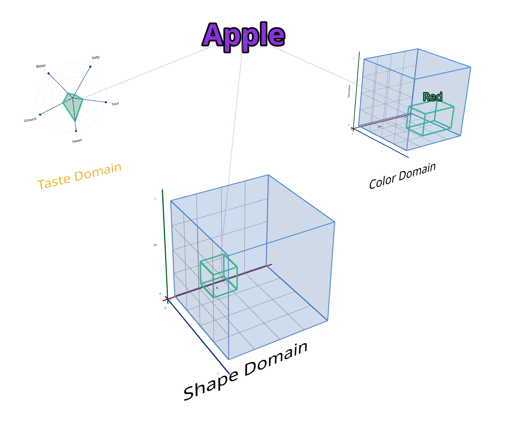

ConceptsLM is a next generation language model. The biggest architectural difference between ConceptsLM and existing LLMs is in the shape of the internal representational structure. For both traditional LLMs and ConceptsLM this internal representational structure functions as the method for which knowledge is encoded and decoded. The difference is that in the case with ConceptsLM the internal representational structure is much lower dimensional and also human readable and understandable.

An LLM's internal representation is hard to interpret because it encodes meaning as tangled patterns of very high-dimensional math rather than in clear human-readable concepts. ConceptsLM encodes traditional human concepts into low dimensional geometric representations.

Lets take for example the concept "apple". In the ConceptsLM representational structure apple is depicted like so...

You can notice the definition of Apple is broken apart into distinct graphs according to the various qualities we understand about an apple. The qualitative taste of apples will be within the range of the taste domain, the visual shape of apples will be within the range of the shape domain, and the color of apples will be within the range of the color domain. By representing the concept of an apple in this way we have a shared representation from which both a language model and human can understand. Read more about the .

We plan to take this low dimensional conceptual data structure and fill in the framework with the roughly ~100,000 words of modern day English. This work is ongoing.

# Benefits 

ConceptsLM does not use a neural network architecture instead it uses the conceptual data structure described above. For this reason, ConceptsLM does not require a GPU. Since ConceptsLM runs on a CPU several important benefits arise.

1. Inference speed is near instant
2. Mobile & offline inference is supported
3. Cost of inference is near zero

Additionally, since the internal representation is human understandable that provides important benefits as well.

1. Easy to debug
2. Easy to modify (training by labeling is possible but not required)
3. Easy to version
4. Easy memory support
5. Easy to query

Lastly, because of the architectural difference in generation ConceptsLM also has the benefits of...

1. No context limit
2. Inductive and deductive reasoning

## Applications

**RAG Pipeline Accuracy** — Solve retrieval intelligence problems: finding precise knowledge, recognizing gaps, handling distributed information across large documents, synthesizing cross-document insights.

**Research Tool** — Built-in explainability and interoperability. "What sources make this answer true?" becomes trivially answerable. Nearby concepts are immediately explorable.

**Codebase Mapping** — Improve AI coding agents by accurately mapping code concepts, enabling better search, understanding, and targeted changes in large codebases.

**News & Policy Mapping** — Track how legislation or court hearings impact your business by mapping conceptual relationships over time.

**Personalized Learning Maps** — Map an individual's conceptual understanding to create personalized learning paths. By visualizing knowledge gaps and connections in a learner's mental model, ConceptsLM enables adaptive education tailored to each person's unique cognitive structure.

**Personalized AI** — Enable AI agents to learn and remember information about you in a queryable way. For example, a web agent booking travel can remember you prefer aisle seats, avoid early morning flights, and always need vegetarian meals—then automatically apply these preferences without asking each time.

**Big Data Searching** — Get structured database benefits without the setup cost. ConceptsLM learns conceptual schemas from natural language, so you can query knowledge like a database without spending weeks designing tables and normalizing data. The structure emerges automatically from understanding natural language.

## MVP Roadmap

Follow and contribute to the [MVP Release](https://github.com/Humata-ai/ConceptsLM/issues/1).
